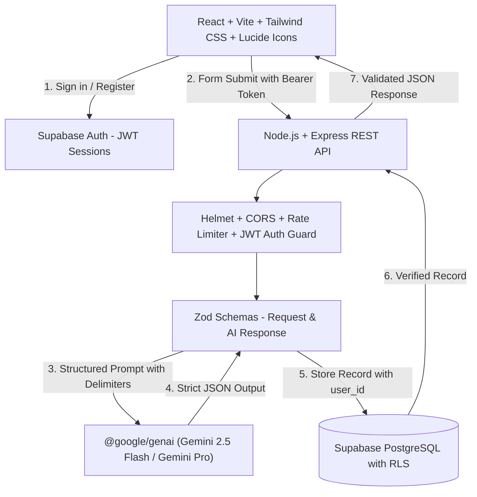

# 🌱 KisanAI - AI-Powered Agriculture Crop Advisory Assistant

A production-grade, full-stack digital agricultural advisory assistant designed to empower farmers with clear, actionable, and scientific crop management recommendations powered by Google Gemini and Supabase.

---

## 🚀 Key Features

* **🌾 Scientific Crop Advisory Engine**: Ingests soil texture, pH, farm size, irrigation availability, growth stages, foliar/pest symptoms, and seasonal microclimate data.
* **🤖 Google Gemini AI Integration**: Powered by `@google/genai` with structured JSON schema validation via Zod, system safety instructions, and controlled retry mechanisms.
* **🛡️ Strict Data Isolation & Security**: Protected by Supabase PostgreSQL Row Level Security (RLS) policies (`auth.uid() = user_id`), Helmet, CORS origin validation, and rate limiting.
* **📋 Actionable Advisory Reports**: Generates crop suitability assessments, prioritized operational steps, domain-specific recommendations (Soil, Irrigation, Nutrients, Crop-care), and pest/disease Integrated Pest Management (IPM) mitigations.
* **🖨️ Field Export & Print Support**: Dedicated print and PDF styling for field agronomists and farmers.
* **📜 Complete Advisory History**: Search, crop filtering, sorting, and user-isolated deletion.
* **📱 Responsive Agrarian Design**: Built with Tailwind CSS, Lucide icons, responsive navigation, glassmorphism cards, and accessibility best practices.

---

## 🛠️ Architecture & Tech Stack



* **Frontend**: React 18, Vite 6, React Router DOM v6, Tailwind CSS v3, Lucide React, Canvas Confetti.
* **Backend**: Node.js ESM, Express.js, `@google/genai`, `@supabase/supabase-js`, Zod, Helmet, CORS, Express Rate Limit.
* **Database & Auth**: Supabase PostgreSQL with RLS, UUID primary keys, and automated migration scripts.

---

## 📂 Project Structure

```text
├── client/
│   ├── src/
│   │   ├── components/
│   │   │   ├── advisory/           # Form sections & AI Loading
│   │   │   ├── advisory-result/    # Structured result cards & action plans
│   │   │   ├── common/             # Button, Input, Select, Card, Badge, Modal, etc.
│   │   │   ├── dashboard/          # Stat cards & recent advisory preview
│   │   │   ├── history/            # History items & search/filter toolbar
│   │   │   └── layout/             # Navbar, AppLayout, ProtectedRoute, AuthGuard
│   │   ├── context/                # AuthContext (session, login, register, logout)
│   │   ├── pages/                  # Landing, Login, Register, Dashboard, NewAdvisory, Details, History, Profile
│   │   ├── services/               # API client & advisoryService
│   │   ├── lib/                    # Supabase client initialization
│   │   ├── App.jsx
│   │   ├── main.jsx
│   │   └── index.css
│   ├── package.json
│   └── vite.config.js
│
├── server/
│   ├── src/
│   │   ├── config/                 # Supabase configuration
│   │   ├── controllers/            # Advisory controller
│   │   ├── middleware/             # requireAuth, rateLimiter, errorHandler
│   │   ├── prompts/                # Agricultural system prompt & XML delimiter builder
│   │   ├── routes/                 # health.routes.js, advisory.routes.js
│   │   ├── schemas/                # Zod request and AI response schemas
│   │   ├── services/               # geminiService.js (@google/genai) & advisoryService.js
│   │   ├── app.js                  # Express app setup
│   │   └── server.js               # Server entry point (Port 5050)
│   ├── package.json
│   └── .env.example
│
├── supabase/
│   └── migrations/
│       ├── 001_initial_schema.sql     # Profiles & Advisories tables
│       ├── 002_rls_policies.sql       # Strict Row Level Security policies
│       └── 003_triggers_indexes.sql   # Updated_at triggers & performance indexes
│
├── README.md
└── package.json
```

---

## ⚙️ Setup & Installation

### 1. Prerequisites
- **Node.js**: v18.0.0 or higher
- **npm**: v9.0.0 or higher

### 2. Install Dependencies
Run from the root workspace:
```bash
npm run install:all
```

### 3. Environment Variables

#### Backend (`server/.env`):
```env
PORT=5050
NODE_ENV=development

# Supabase Credentials (Optional for local demo mode)
SUPABASE_URL=https://your-project.supabase.co
SUPABASE_ANON_KEY=your-supabase-anon-key
SUPABASE_SERVICE_ROLE_KEY=your-supabase-service-role-key

# Google Gemini API Key
GEMINI_API_KEY=your-gemini-api-key
GEMINI_MODEL=gemini-2.5-flash

# Frontend Origin for CORS
FRONTEND_URL=http://localhost:5173
```

#### Frontend (`client/.env`):
```env
VITE_SUPABASE_URL=https://your-project.supabase.co
VITE_SUPABASE_ANON_KEY=your-supabase-anon-key
VITE_API_BASE_URL=http://localhost:5050/api
```

---

## 🏃 Running the Application

### Concurrently (Frontend + Backend):
```bash
npm run dev
```

### Or Individually:
```bash
# Terminal 1: Backend Server (Port 5050)
cd server && npm run dev

# Terminal 2: Frontend Client (Port 5173)
cd client && npm run dev
```

Open your browser and navigate to: **`http://localhost:5173/`**

---

## 🗄️ Database Setup (Supabase PostgreSQL)

Execute the migrations in order in your Supabase SQL Editor:
1. `supabase/migrations/001_initial_schema.sql`
2. `supabase/migrations/002_rls_policies.sql`
3. `supabase/migrations/003_triggers_indexes.sql`

---

## 🛡️ Responsible AI Disclaimers

KisanAI operates under strict responsible AI guidelines:
1. AI outputs are structured recommendations and do not guarantee exact crop yields or legal pesticide clearance.
2. The AI distinguishes between suspected symptoms and confirmed diagnoses.
3. Information gaps are explicitly surfaced when critical field parameters (e.g. soil test pH) are omitted.
